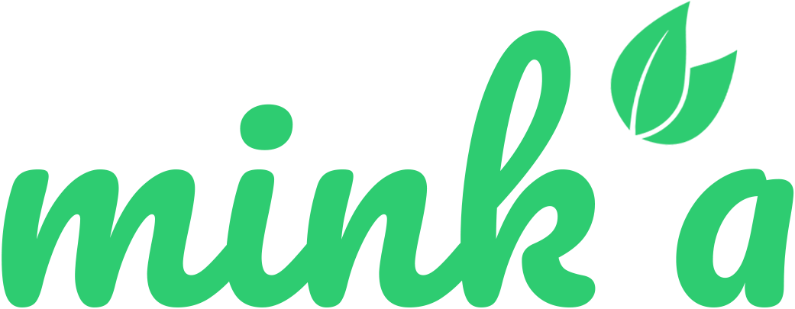

<!-- markdownlint-disable MD033 -->
<h1 align="center">Mink’a Landing Page</h1>
<p align="center">
  
</p>
<p align="center"><strong>Economía circular al alcance de tu comunidad</strong></p>
<p align="center">
  <a href="https://trinity-bytes.github.io/minka/" target="_blank">
    
  </a>
</p>

## 🧭 Tabla de Contenidos

- [🧭 Tabla de Contenidos](#-tabla-de-contenidos)
- [📌 Descripción del Proyecto](#-descripción-del-proyecto)
- [🎯 Segmento Objetivo](#-segmento-objetivo)
- [🌟 Características Principales](#-características-principales)
- [🏗️ Arquitectura de la Landing](#️-arquitectura-de-la-landing)
- [🚀 Tecnologías Utilizadas](#-tecnologías-utilizadas)
- [🛠️ Guía de Uso y Desarrollo](#️-guía-de-uso-y-desarrollo)
- [👥 Autores](#-autores)
- [🔗 Acceso Rápido](#-acceso-rápido)

<a id="descripcion-del-proyecto"></a>

## 📌 Descripción del Proyecto

Mink’a es una plataforma digital orientada a la economía circular y el trueque comunitario. Esta landing page comunica la propuesta de valor de la solución, presenta beneficios claves y acompaña al usuario hacia el registro y la descarga del prototipo interactivo.

<a id="segmento-objetivo"></a>

## 🎯 Segmento Objetivo

- Personas urbanas en Lima Metropolitana con interés en reducir costos y fomentar la reutilización.
- Usuarios que desean intercambiar objetos y servicios de forma segura, confiable y transparente.
- Comunidades que promueven prácticas sostenibles, colaborativas y de impacto ambiental positivo.

<a id="caracteristicas-principales"></a>

## 🌟 Características Principales

- **Diseño responsivo:** experiencia consistente en dispositivos móviles, tabletas y escritorio.
- **Accesibilidad base:** uso de roles ARIA, contraste AA y soporte para navegación por teclado.
- **Secciones informativas clave:**
  - Hero con CTA principal.
  - Tres pasos que explican cómo funciona Mink’a.
  - Beneficios del trueque y su aporte al ahorro.
  - Indicadores de impacto ambiental y social.
  - Voces reales de la comunidad (testimonios).
- **Optimización del performance:** imágenes comprimidas y carga diferida para conexiones limitadas.
- **Despliegue automatizado:** integración con GitHub Pages para actualizaciones rápidas.

<a id="arquitectura-de-la-landing"></a>

## 🏗️ Arquitectura de la Landing

```text
public/
├── index.html          # Página principal con la estructura base del contenido
└── assets/
    ├── styles/styles.css   # Estilos globales y variables de diseño
    └── scripts/main.js     # Comportamientos interactivos y componentes dinámicos
```

<a id="tecnologias-utilizadas"></a>

## 🚀 Tecnologías Utilizadas

- HTML5 semántico para estructura y contenido.
- CSS3 (flexbox, grid y variables personalizadas) para estilos responsivos.
- JavaScript ES6+ para interactividad ligera y progresiva.
- GitHub Pages para hosting continuo.
- Flujo de trabajo GitFlow para organización del equipo.

<a id="guia-de-uso-y-desarrollo"></a>

## 🛠️ Guía de Uso y Desarrollo

1. **Clona el repositorio:** `git clone https://github.com/Reflow-Tech-UPC/Minka-Landingpage.git`
2. **Instala dependencias:** no se requieren dependencias externas; basta con un navegador moderno.
3. **Ejecuta en local:** abre `public/index.html` en tu navegador favorito.
4. **Crea una rama de trabajo:** `git checkout -b feature/nueva-seccion`
5. **Haz commit con convenciones claras** (ej. `feat: agrega sección de preguntas frecuentes`).
6. **Publica en GitHub Pages:** al fusionar con la rama principal, el despliegue se actualiza automáticamente.

<a id="autores"></a>

## 👥 Autores

- Leonardo Chávez
- Lucero Pipa
- Ronel Rojas
- Andy Salcedo
- Miguel Sanca
- Jahat Trinidad

<a id="acceso-rapido"></a>

## 🔗 Acceso Rápido

- Landing Page: [https://trinity-bytes.github.io/minka/](https://trinity-bytes.github.io/minka/)
- Repositorio: [https://github.com/trinity-bytes/minka](https://github.com/trinity-bytes/minka)

<p align="center">💚 Construido con dedicación para impulsar la colaboración y la sostenibilidad por el team Reflow Tech.</p>
